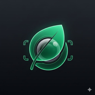

<div align="center">



# EcoScan

**AI-powered waste segregation for India — scan, learn, act.**

[](https://nextjs.org)
[](https://firebase.google.com)
[](https://ai.google.dev)
[](https://web.dev/progressive-web-apps/)


</div>

---

## The Problem

India produces **62 million tonnes of waste every year.** Only **20% is properly segregated** at source — the rest ends up mixed in landfills, making recycling almost impossible.

Most people *want* to segregate, they just don't know *how* — which bin for a medicine strip? Is a broken charger dry waste or e-waste?

**EcoScan answers that question in 3 seconds.**

---

## What It Does

Point your phone at any waste item → EcoScan's AI tells you exactly what it is, which bin it goes in, and how to dispose of it — with Hindi voice instructions for accessibility.

No app store. No install friction. Opens in the browser like a website, works like a native app.

| Step | What happens |
|------|-------------|
| 📷 Scan | Take a photo or upload from gallery |
| 🤖 Classify | Gemini Vision AI identifies the item + category in ~3s |
| 🗣️ Learn | Disposal steps + Hindi voice guidance auto-play |
| 📍 Act | Find the nearest disposal center on map |
| ⚡ Earn | Get EcoPoints, climb the leaderboard |

---

## Features

**Core**
- Classifies waste into 4 categories: Dry ♻️ · Wet 🌿 · Hazardous ⚠️ · E-Waste 💻
- Hindi voice instructions (Web Speech API) — works without internet after first load
- GPS-based disposal map with category filtering
- Confidence score + recyclability flag on every scan

**Community & Gamification**
- Weekly + all-time leaderboard with podium
- EcoPoints system (10–25 pts per scan by category)
- User feedback loop — rate AI accuracy, corrections stored for future model training
- Achievements, streak tracking, CO₂ saved estimate on profile

**Trust & Integrity**
- Duplicate image fingerprinting — same photo scores 0 pts
- 60-second scan cooldown, 20 scans/day cap
- Diminishing returns for scanning only one category repeatedly
- All rules visible in-app on the leaderboard screen

---

## Tech Stack

```
Frontend       Next.js 14 (App Router) · TypeScript · Tailwind CSS · Framer Motion
Maps           Leaflet + React-Leaflet · CartoDB dark tiles · Nominatim geocoding
AI             Google Gemini 2.5 Flash Vision API (serverless API route)
Auth & DB      Firebase Auth (anonymous + Google) · Firestore real-time
PWA            Web App Manifest · standalone display · install-to-home-screen
Voice          Web Speech API · Hindi (hi-IN) + English (en-IN)
Charts         Recharts (profile waste breakdown pie)
Demo           Local machine · same Wi‑Fi (see below) — no cloud host required for judges
```

---

## How It Works

```
Camera / Gallery
      │
      ▼
/api/classify  ──→  Gemini 2.5 Flash Vision
      │                   │
      │          Returns JSON:
      │          { category, disposal_steps,
      │            hindi_instruction, points,
      │            fun_fact, confidence }
      │
      ▼
Anti-abuse check
(duplicate hash · cooldown · daily cap · category spam multiplier)
      │
      ├─ blocked? → show warning, skip navigation
      │
      ▼
Result page (sessionStorage)
+ Firebase recordScan (points, streak, scan history)
+ Real-time leaderboard update (onSnapshot)
      │
      ▼
User gives feedback (correct / wrong category)
→ feedback_stats collection
→ Future: fine-tune custom model on India-specific waste
```

---

## Scoring

| Category | Points | Reason |
|----------|--------|--------|
| ♻️ Dry / 🌿 Wet | 10 pts | Most common — baseline |
| ⚠️ Hazardous | 20 pts | Higher risk, needs special handling |
| 💻 E-Waste | 25 pts | Least understood, most impactful |
| ✅ Feedback given | +5 pts | Rewards accuracy improvement |
| 🔁 Duplicate image | 0 pts | Anti-gaming |

---

## Local Setup

**Prerequisites:** Node.js 18+, Firebase project, Google AI Studio API key

```bash
git clone https://github.com/heyyadarsh/ecoscan.git
cd ecoscan
npm install
cp .env.example .env.local   # fill in your keys
npm run dev
```

Open **http://localhost:3000** in your browser.

---

## Demo for judges (phone on same Wi‑Fi, no Vercel)

Use this when you want judges to open the app on their **phones** while your laptop runs the app.

### 1. On your laptop

```bash
npm run dev:lan
```

This binds the dev server to all interfaces (`0.0.0.0`) on port **3000**.

### 2. Find your laptop’s LAN IP

| OS | How |
|----|-----|
| **macOS** | System Settings → Network → Wi‑Fi → Details → IP, or run: `ipconfig getifaddr en0` |
| **Windows** | `ipconfig` → look for **IPv4** under Wi‑Fi (e.g. `192.168.1.42`) |
| **Linux** | `hostname -I` or `ip addr` |

### 3. Optional — fix hot-reload when opening from the phone

If the page loads but the dev console shows WebSocket / HMR errors, add to **`.env.local`** (use **your** IP and port):

```env
NEXT_DEV_LAN_ORIGIN=http://192.168.x.x:3000
```

Restart `npm run dev:lan`.

### 4. On the judge’s phone (same Wi‑Fi as laptop)

Open in the browser:

```text
http://YOUR_LAN_IP:3000
```

Example: `http://192.168.1.42:3000`

### 5. Firebase (Google sign-in from the phone)

1. [Firebase Console](https://console.firebase.google.com) → your project → **Authentication** → **Settings** → **Authorized domains**
2. Add your **IP as a domain** if listed (e.g. `192.168.1.42`), or use **Anonymous** auth for a quick demo if OAuth blocks LAN URLs.

**Note:** `http://` on a LAN IP is **not** a “secure context” in Chrome, so **PWA install / service worker** may not work from the phone URL. **Scanning, AI, map, Firebase, and leaderboard still work** in the browser. Full PWA install needs `https://` (e.g. a future deploy) or testing on **localhost** on the device.

### 6. Production-style test on your machine only

```bash
npm run build
npm run start
```

By default `next start` listens on all interfaces; use `http://YOUR_LAN_IP:3000` the same way (set `PORT` if you change the port).

---

**.env.local** (same as `.env.example`)

```env
NEXT_PUBLIC_FIREBASE_API_KEY=
NEXT_PUBLIC_FIREBASE_AUTH_DOMAIN=
NEXT_PUBLIC_FIREBASE_PROJECT_ID=
NEXT_PUBLIC_FIREBASE_STORAGE_BUCKET=
NEXT_PUBLIC_FIREBASE_MESSAGING_SENDER_ID=
NEXT_PUBLIC_FIREBASE_APP_ID=
GEMINI_API_KEY=
```

**Firestore Rules** — paste in Firebase Console → Firestore → Rules:
```
rules_version = '2';
service cloud.firestore {
  match /databases/{database}/documents {
    match /users/{userId} {
      allow read: if request.auth != null;
      allow write: if request.auth != null && request.auth.uid == userId;
    }
    match /scans/{scanId} {
      allow read, list: if request.auth != null;
      allow create: if request.auth != null && request.auth.uid == request.resource.data.userId;
    }
    match /feedback/{docId}  { allow read: if request.auth != null; allow create: if true; }
    match /feedback_stats/{id} { allow read, write: if true; }
    match /abuse_tracking/{userId} {
      allow read, write: if request.auth != null && request.auth.uid == userId;
    }
  }
}
```

---

## What's Next

- [ ] Custom ML model trained on feedback corrections (India-specific waste images)
- [ ] Ward-level leaderboard for Swachh Bharat municipal competitions
- [ ] Offline AI using TensorFlow.js (works without internet)
- [ ] Municipal corporation API for real disposal center data
- [ ] WhatsApp bot interface for feature phones

---

## Built By

**Team — Rackze (ITM University Gwalior, MP** Hackathon)

Adarsh Parashar · Harsh Jain

Built for Hackathon 2026 · Smart Cities & Sustainability Track

---

<div align="center">
  <sub>India's waste problem is solvable. It starts with knowing which bin to use.</sub>
</div>
